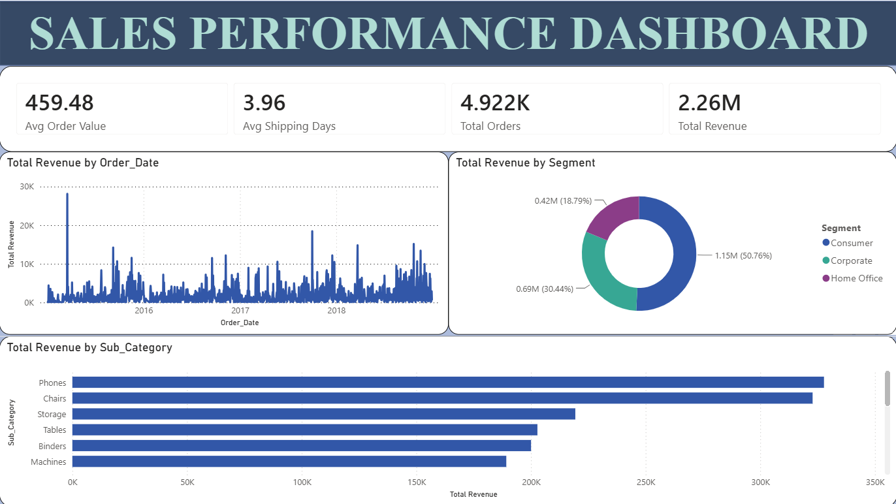

# 📊 Sales Data Pipeline & Interactive Analytics Dashboard

An end-to-end data analytics project demonstrating data ingestion, ETL processing in Python, Star Schema data modeling, SQL query analytics, and an interactive Power BI dashboard.

---

## 🛠️ Architecture & Tech Stack
* **ETL & Data Cleaning:** Python 3 (Pandas, Datetime)
* **Data Modeling:** SQL / SQLite (Star Schema: 1 Fact Table, 4 Dimension Tables)
* **Analytics & Reporting:** Power BI Desktop (DAX, Interactive Slicers, Custom UI)
* **Source Dataset:** Kaggle Superstore Retail Sales Data

---

## 📐 Data Architecture (Star Schema)
[DimCustomer]            [DimProduct]
         \                        /
          \                      /
        +--------------------------+
        |        FactSales         |
        +--------------------------+
           /                    \
          /                      \
   [DimLocation]              [DimDate]

---

   ## 💡 Key Business Insights
* **Holiday Seasonality:** Sales consistently peak in Q4 (October–December), generating ~35% of total annual revenue.
* **Product Drivers:** Technology leads total revenue, driven by high average order values in Phones and Office Chairs.
* **Customer Segment Breakdown:** The Consumer segment accounts for ~50% of revenue, followed by Corporate (~30%) and Home Office (~20%).
* **Shipping Performance:** Same Day shipping achieves 0-day turnaround, while Standard Class averages ~5 days.

---

## 📁 Repository Structure
├── data_cleaning.py          # Python ETL and cleaning script
├── cleaned_sales_data.csv     # Cleaned dataset ready for SQL/BI
├── queries.sql               # Star Schema DDL & analytical queries
├── Sales_Dashboard.pbix      # Power BI dashboard workbook file
├── dashboard_preview.png     # Screenshot of executive dashboard
└── README.md                 # Project documentation
